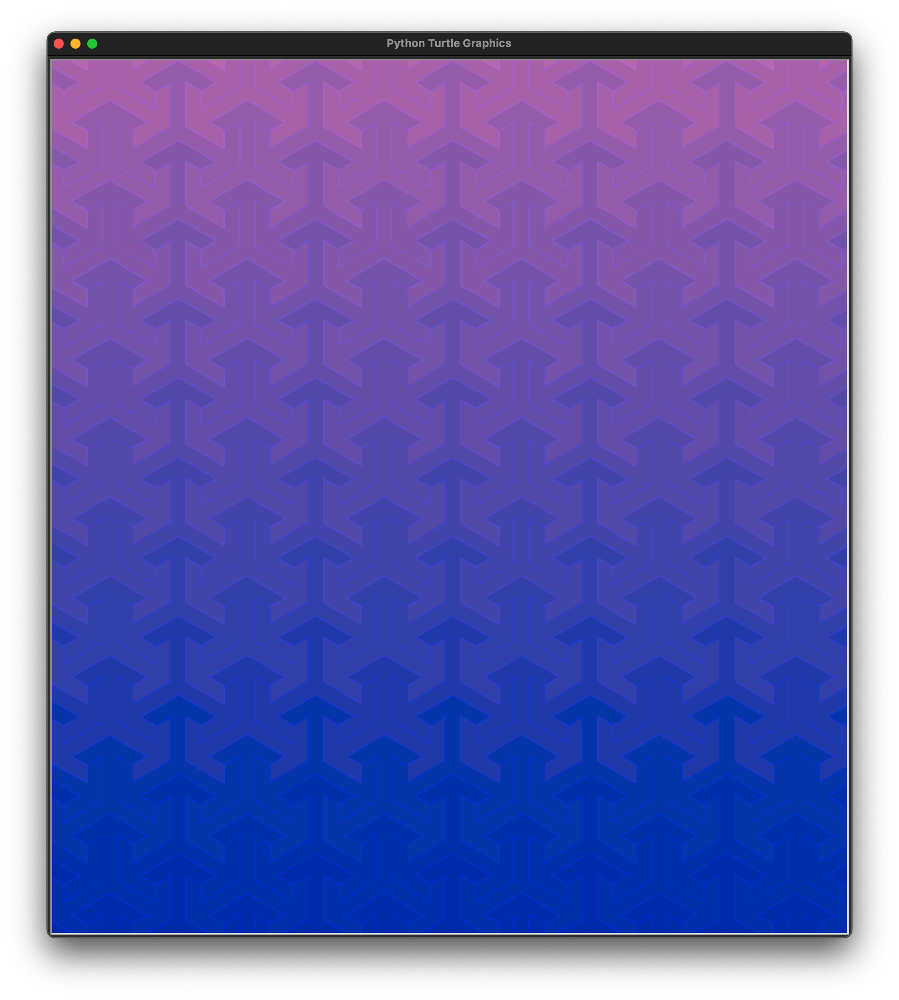
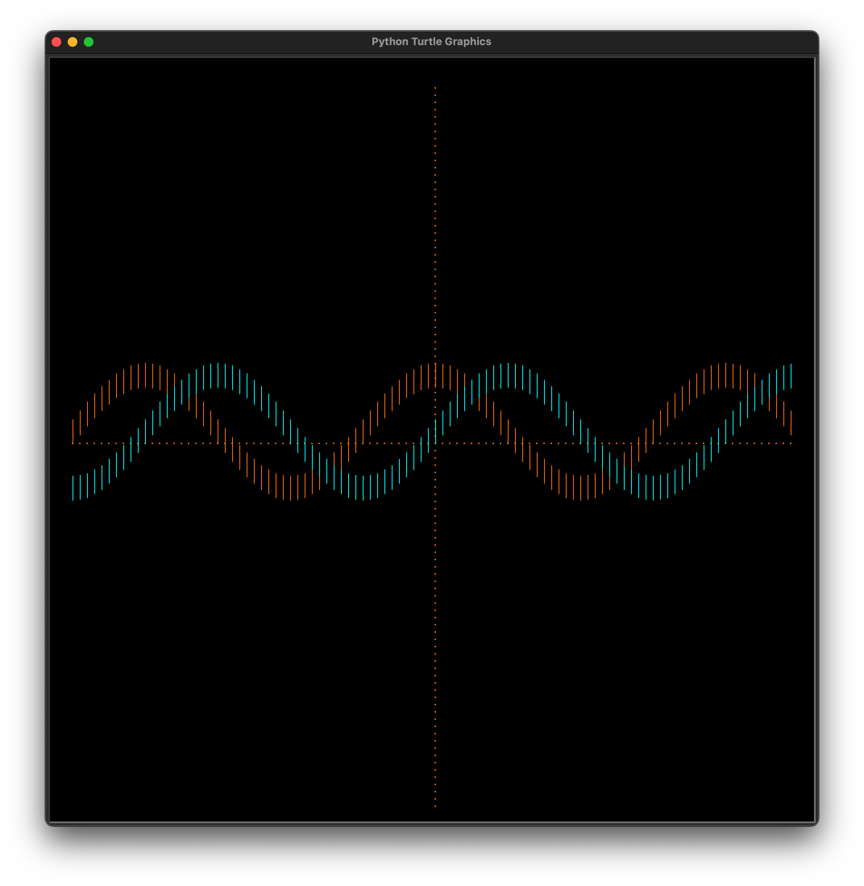

# Python Turtle demos 

A python turtle graphics demo, drawing tesselated tri-arrows, iso-cubes, trig-functions, exponent

For more on Turtle graphics, see the [Logo Programming Language](https://wikipedia.org/wiki/Logo_\(programming_language\))
